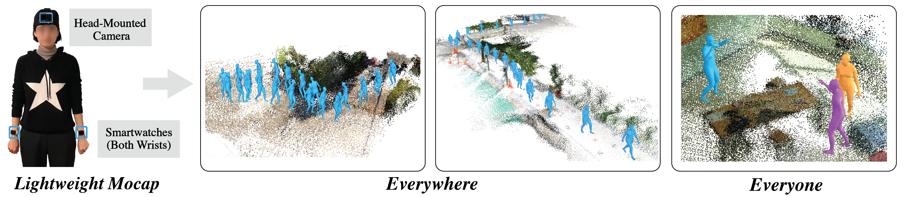

<p>
<h1>Mocap Everyone Everywhere: Lightweight Motion Capture With Smartwatches and a Head-Mounted Camera (CVPR 2024) </h1>
</p>

## [Project Page](https://jiyewise.github.io/projects/MocapEvery) &nbsp;|&nbsp; [Paper](https://arxiv.org/abs/2401.00847) 

<br>
<div align="center">

</div>
<br>

Author's implementation of the paper Mocap Everyone Everywhere: Lightweight Motion Capture With Smartwatches and a Head-Mounted Camera (CVPR 2024). 

### Installation
#### Setup
Note: This code was developed on Ubuntu 20.04 with Python 3.8, CUDA 11.7 and PyTorch 1.13.1.

Clone the repo and setup virtual environment.
```
git clone https://github.com/jiyewise/MocapEvery.git
cd MocapEvery
conda create -n mocap_env python=3.8
conda activate mocap_env 
```

All dependencies can be installed at once by the command below.
```
zsh install_total.sh
```
Note that in this repo we use a modified version of the [FairMotion](https://github.com/facebookresearch/fairmotion) library. 

#### Data
Download SMPL-H (for quant. evaluation) and SMPL-X models and place into `data/smpl_models` folder.
(Optional) Change the `BM_PATH` and `SMPLH_BM_PATH` in `constants/motion_data.py` to the path where the SMPL-X/-H models are located.

### Demos with Real Data
Download pretrained model `imu_realdata_model` from the [link](https://drive.google.com/drive/folders/1TJiJToLWM5FpzEkbmEbylEuG6XmnOtvY?usp=sharing) and unzip into `imu2body/output/` folder.
Download example dataset(named as `1029`, `1105`) from the [link](https://drive.google.com/drive/folders/1TJiJToLWM5FpzEkbmEbylEuG6XmnOtvY?usp=sharing).
Change the `DATA_PATH` in `constants/path.py` to the path where the example dataset is located.
```
DATA_PATH
    ├── 1029 # REALDATA_FOLDER (demo for optimization module)
    └── 1105 # REALDATA_FOLDER 
        ├── sfm # sfm data (includes camera intrinsics, etc) 
        ├── video # egocentric video
        ├── watch_sensorlog_1.csv # Apple watch IMU data (1: left) 
        ├── watch_sensorlog_2.csv # Apple watch IMU data (2: right) 
        └── ... 

```
After downloading, run the following commands:
```
cd realdata
python3 realdata_network_run.py --test_name=imu_realdata_model --rdc-folder=1105
# results would be saved in imu2body/imu_realdata_model/custom/1105.pkl
# for long sequences (e.g., 1105) loading the renderer would take some time
python3 visualize_rdn_w_scene.py --test-name=imu_realdata_model --rdc-folder=1105 # for visualization
```

To run the optimization module (Sec. 3.4), download the pretrained autoencoder model `autoencoder_pretrained` from the [link](https://drive.google.com/drive/folders/1TJiJToLWM5FpzEkbmEbylEuG6XmnOtvY?usp=sharing) and unzip into `autoencoder_v2/output/` folder.
Then, run the following commands:
```
cd realdata
python3 realdata_network_run.py --test_name=imu_realdata_model --rdc-folder=1029
cd ../interaction
python3 editor.py --rdc-folder=1029 --test-name=imu_realdata_model --ae-test-name=autoencoder_pretrained --save-name=1029_edit_result
python3 vis_edit_result.py --save-name=1029_edit_result
```
Red character indicates initial motion from the motion estimation module, while the blue one is the edited motion by the optimization module.

#### Visualizer Keys:
1. s: Reset
2. [: Move 1 frame backward ]: Move 1 frame forward
3. -: Move 5 frame backward +: Move 5 frame forward
4. Space: Pause
5. 1: (Editor only) Show edited motion only
6. 2: (Editor only) Show initial motion only
7. 3: (Editor only) Show both motions
8. o: Reduce point size in pointcloud render
9. p: Increase point size in pointcloud render
10. q: (Testset visualizer only) Skip to previous sequence
11. w: (Testset visualizer only) Skip to next sequence


### Evaluation
0. Data Path Structure
    ```
    PATH_TO_AMASS
        ├── TotalCapture
        ├── BMLMovi
        ├── CMU
        └── HDM05
    PATH_TO_HPS # unzip HPS 
        ├── hps_smpl 
        ├── hps_betas
        └── ...
    ```
For AMASS motions, download SMPL-H (MALE) version for evaluation.

1. For quant. eval on IMU baselines (Table 1), download the pretrained model `imu_pretrained` from the [link](https://drive.google.com/drive/folders/1TJiJToLWM5FpzEkbmEbylEuG6XmnOtvY?usp=sharing) and place in the `imu2body_eval/output` folder. 
Download the real IMU signals `TotalCapture_Real_60FPS` from the TotalCapture dataset [here](https://dip.is.tue.mpg.de/download.php). Following [Transformer Inertial Poser](https://github.com/jyf588/transformer-inertial-poser), we use the processed raw IMU signals from the DIP authors and use the SMPL poses from the TotalCapture included in [AMASS dataset](https://amass.is.tue.mpg.de/) as ground truth.

    Change the `TC_DIR` in `constants/path.py` to the path where the `TotalCapture_Real_60FPS` is located.

    After downloading, run the following commands:
    ```
    python3 eval_by_files.py --data-config-path=./data_config/ --base-dir=PATH_TO_AMASS --save-path=PATH_TO_SAVE_PREPROCESS_TC --data-type=tc
    python3 run_eval.py --test_name=imu_pretrained --mode=test --eval-path=PATH_TO_SAVE_PREPROCESS_TC  
    ```

2. For quant. eval on VR baselines (Table 2), download the pretrained model `vr_pretrained` from the [link](https://drive.google.com/drive/folders/1TJiJToLWM5FpzEkbmEbylEuG6XmnOtvY?usp=sharing) and place in the `imu2body_eval/output` folder. 
    - For evaluating on the AMASS dataset, download BMLMovi, CMU, HDM05 dataset from [AMASS dataset link](https://amass.is.tue.mpg.de/).
    - For evaluating on the HPS, download the dataset from the [HPS dataset link](https://virtualhumans.mpi-inf.mpg.de/hps/download_and_license.html).

    After downloading, run the following commands:
    ```
    cd imu2body_eval
    # generate preprocessed files
    python3 eval_by_files.py --data-config-path=./data_config/ --base-dir=PATH_TO_AMASS --save-path=PATH_TO_SAVE_PREPROCESS_AMASS_VR  --data-type=amass_vr  
    python3 eval_by_files.py --data-config-path=./data_config/ --base-dir=PATH_TO_HPS --save-path=PATH_TO_SAVE_PREPROCESS_HPS_VR --data-type=hps

    # run evaluation 
    python3 run_eval.py --test_name=vr_pretrained --mode=test --eval-path=PATH_TO_SAVE_PREPROCESS_AMASS_VR
    python3 run_eval.py --test_name=vr_pretrained --mode=test --eval-path=PATH_TO_SAVE_PREPROCESS_HPS_VR  
    ```


### Training
To train the motion estimation module, first preprocess the data with the following command.
```
cd imu2body
python3 preprocess.py --data-config-path=./data_config/ --base-dir=PATH_TO_AMASS --preprocess-path=PATH_TO_PREPROCESS_PATH 
```
Then, start training with the following command. (Example file is in `imu2body/config`.) Change to `preprocess: PATH_TO_PREPROCESS_PATH` in the config file. You can adjust other hyperparameters if needed.
```
python3 run.py --test_name=MODEL_NAME --mode=train --config=example_config  
```
To visualize results on the test data, run the following command:
```
python3 run.py --test_name=MODEL_NAME --mode=test --config=example_config 
# results would be saved in output/MODEL_NAME/testset_{IDX}/{MM-DD-HH-SS}.pkl
python3 visualize_testset.py --test-name=MODEL_NAME --idx=IDX --file-name=MM-DD-HH-SS
```

#### Note
1. The files in the folder `imu2body` and `imu2body_eval` are almost identical. The differences are that `imu2body_eval` does not include height adjustment/changes to be fair with baselines. 
2. The pretrained models for evaluation are trained with SMPL-H model to be fair with baselines. Change `CUR_BM_TYPE` in `preprocess.py`, `run.py`, and `visualize_testset.py` to use SMPL-H (SMPL-X is default). 

### System Run
#### Video Protocol for Calibration
Coming soon!
#### Preprocessing
From the data downloaded from the above link, run the following commands to preprocess the data.
1. Run [DROID-SLAM](https://github.com/princeton-vl/DROID-SLAM):
Clone [DROID-SLAM](https://github.com/princeton-vl/DROID-SLAM) into `./libraries` folder and replace the original `./libraries/DROID-SLAM/droid_slam` to the modified version `./libraries/DROID-SLAM-modified/droid_slam` in this repo. Modifications are made in the `droid_slam/droid.py` and `droid_slam/visualization.py` to retrieve pointcloud and save camera trajectory. 
Run the following commands to install [DROID-SLAM](https://github.com/princeton-vl/DROID-SLAM). For installation issues, please refer to the original repo.
    ```
    cd libraries/DROID-SLAM
    python3 setup.py install
    ```
    Parse the video in `REALDATA_FOLDER/video/ego_video.MP4` into a sequence of images and save into `REALDATA_FOLDER/sfm/images`. Refer to `realdata/utils.py` for parsing function.
    After parsing, run the following command:
    ```
    cd realdata
    python3 droid_demo.py --data-name=REALDATA_FOLDER --stride=1 --buffer 2560   
    ```
    The results would generate files `cam_traj.pkl` and pointcloud `pcd_results.ply`.

2. Check signal alignment 
    ```
    cd realdata
    python3 realdata_collection.py --data-name=REALDATA_FOLDER 
    ```
    If run properly, a plot of IMU acceleration signal of both wrists would appear.

3. Run network and visualize (same as [Real Data Demo Section](#demos-with-real-data))
    ```
    cd realdata
    python3 realdata_network_run.py --test_name=imu_realdata_model --rdc-folder=REALDATA_FOLDER
    python3 visualize_rdn_w_scene.py --test-name=imu_realdata_model --rdc-folder=REALDATA_FOLDER
    ```

### Bibtex
If you find the repo useful, please cite:
```
@inproceedings{lee2024mocapevery,
    title = {Mocap Everyone Everywhere: Lightweight Motion Capture With Smartwatches and a Head-Mounted Camera},
    author = {Lee, Jiye and Joo, Hanbyul},
    booktitle = {Proceedings of the IEEE/CVF Conference on Computer Vision and Pattern Recognition (CVPR)},
    year = {2024}
}
```

### Thanks To
- [FairMotion](https://github.com/facebookresearch/fairmotion)
- [Transformer Inertial Poser](https://github.com/jyf588/transformer-inertial-poser)
